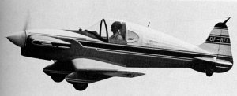

Math Magic WR-1
###############
:Author: Roie R. Black
:EMail: roie.black@gmail.com
:Docs: https://rblack42.github.io/math-magic-wr-1

This project uses *OpenSCAD* to design an indoor No-Cal rubber powered model of
Neal Loving's WR-1 Goodyear Racer. Neal was in the same EAA Chapter in
Springfield, Ohio I joined when I started my first assignment as a research
scientist at Wright-Patterson AFB in Dayton, Ohio. Later, my research group was
reassigned to the USAF Flight Dynamics Laboratory, where Neal also worked. 

I never got to see this airplane fly. It currently hangs on the wall in the EAA
Museum in Oskosh, Wisconson. Neal built a nice two-place tandom low wing
airplane with folding wings while in Dayton. He towed that airplane to our EAA
meetings, and ten minutes after the meeting ended, he unfolded the wings and
went for an eveing flight around the airport at Springfield. While I was
working on my Private Polio't License, I soloed at that airport as well.

Fond memories!

..  image:: assets/images/rLloving-WR-1-Love.jpg
    :width: 500
    :align: center
